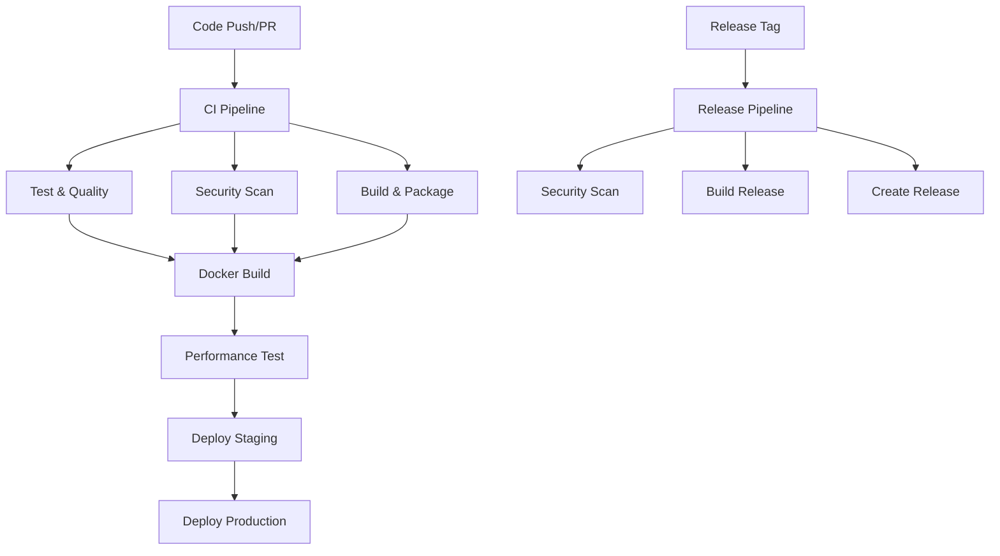

# CI/CD Pipeline Documentation

This document describes the Continuous Integration and Continuous Deployment (CI/CD) pipeline for the Academic Workflow Assistant.

## Overview

Our CI/CD pipeline is built with GitHub Actions and provides comprehensive automation for:

- **Code Quality Assurance**: Linting, type checking, and testing
- **Security Scanning**: Vulnerability detection and compliance checking
- **Build and Packaging**: Docker image creation and artifact generation
- **Deployment**: Automated staging and production deployments
- **Monitoring**: Performance testing and security monitoring

## Pipeline Architecture



## Workflows

### 1. Continuous Integration (ci.yml)

**Triggers**: Push to main/develop, Pull Requests

**Jobs**:
- **Test & Code Quality**: Runs tests, linting, and type checking
- **Security**: CodeQL analysis and dependency scanning
- **Build**: Creates production build and artifacts
- **Docker**: Builds and pushes Docker images
- **Performance**: Lighthouse performance testing
- **Deploy**: Automated staging and production deployment

**Key Features**:
- Multi-platform Docker builds (AMD64, ARM64)
- Comprehensive test coverage reporting
- Security vulnerability scanning
- Performance benchmarking
- Automated deployment to staging

### 2. Release Pipeline (release.yml)

**Triggers**: Git tags (v*)

**Jobs**:
- **Release**: Creates GitHub release with changelog
- **Build**: Full application build and testing
- **Docker Release**: Tagged Docker image creation
- **Security Scan**: Trivy vulnerability scanning
- **Artifacts**: Deployment package creation
- **Notify**: Release notifications

**Key Features**:
- Automatic changelog generation
- Multi-platform release images
- Security scanning of release artifacts
- Deployment package creation
- SBOM (Software Bill of Materials) generation

### 3. Security Pipeline (security.yml)

**Triggers**: Schedule (daily), Push to main, Manual trigger

**Jobs**:
- **Dependency Scan**: npm audit and Snyk scanning
- **Code Security**: CodeQL security analysis
- **Secret Scan**: TruffleHog secret detection
- **Docker Security**: Trivy and Hadolint scanning
- **Infrastructure Security**: Checkov policy scanning
- **Security Test**: OWASP ZAP penetration testing
- **Compliance**: Security policy compliance checks
- **License Scan**: FOSSA license compliance

**Key Features**:
- Daily security monitoring
- Multiple security scanning tools
- SARIF format for GitHub Security tab
- Comprehensive compliance checking
- Automated security reporting

## Security Integration

### Vulnerability Scanning

1. **Dependencies**: npm audit + Snyk
2. **Code**: CodeQL security queries
3. **Secrets**: TruffleHog scanning
4. **Docker**: Trivy vulnerability scanning
5. **Infrastructure**: Checkov policy scanning

### Security Testing

- **OWASP ZAP**: Automated penetration testing
- **Hadolint**: Dockerfile security linting
- **Secret Detection**: Pre-commit and CI scanning
- **License Compliance**: FOSSA scanning

### Security Reporting

All security results are uploaded to GitHub Security tab using SARIF format for centralized visibility and management.

## Quality Gates

### Code Quality Requirements

- ✅ All tests must pass
- ✅ ESLint checks must pass
- ✅ TypeScript compilation must succeed
- ✅ Test coverage must meet minimum threshold
- ✅ No high-severity security vulnerabilities

### Performance Requirements

- ✅ Lighthouse Performance Score ≥ 80
- ✅ Lighthouse Accessibility Score ≥ 90
- ✅ Build time < 10 minutes
- ✅ Docker image size < 500MB

### Security Requirements

- ✅ No secrets in code
- ✅ No critical vulnerabilities
- ✅ Security headers properly configured
- ✅ OWASP ZAP baseline scan passes

## Environment Configuration

### Development
- **Branch**: develop
- **Docker Tag**: develop
- **Deployment**: Automatic on merge
- **Testing**: Full test suite

### Staging
- **Branch**: main
- **Docker Tag**: main-{sha}
- **Deployment**: Automatic on merge to main
- **Testing**: Performance and security testing

### Production
- **Trigger**: Manual approval after staging
- **Docker Tag**: latest, stable
- **Deployment**: Blue-green deployment
- **Monitoring**: Full observability stack

## Deployment Strategy

### Staging Deployment

1. **Automatic Trigger**: Merge to main branch
2. **Environment**: staging
3. **Database**: Isolated staging database
4. **Testing**: Performance and security validation
5. **Approval**: Automatic progression to production

### Production Deployment

1. **Trigger**: Manual approval or successful staging deployment
2. **Strategy**: Blue-green deployment with health checks
3. **Rollback**: Automatic rollback on health check failure
4. **Monitoring**: Real-time monitoring and alerting

## Secrets Management

### GitHub Secrets

Required secrets for CI/CD pipeline:

```bash
# Container Registry
GITHUB_TOKEN                 # Automatic (GitHub provides)

# Security Scanning
SNYK_TOKEN                  # Snyk security scanning
CODECOV_TOKEN               # Code coverage reporting
FOSSA_API_KEY              # License compliance scanning

# Application Secrets (for testing)
ANTHROPIC_API_KEY          # AI provider API key
OPENAI_API_KEY             # AI provider API key
SETTINGS_ENCRYPTION_KEY    # Application encryption key
NEXTAUTH_SECRET            # NextAuth.js secret
JWT_SECRET                 # JWT signing secret

# Database
POSTGRES_PASSWORD          # PostgreSQL password
REDIS_PASSWORD             # Redis password

# Monitoring (optional)
GRAFANA_PASSWORD           # Grafana admin password
```

### Secret Rotation

- **Frequency**: Quarterly or on compromise
- **Process**: Update in GitHub Secrets, redeploy
- **Validation**: Automated testing with new secrets
- **Monitoring**: Alert on secret usage anomalies

## Monitoring and Observability

### Pipeline Monitoring

- **Success Rate**: Track pipeline success/failure rates
- **Build Time**: Monitor build performance
- **Test Results**: Track test coverage and reliability
- **Security Findings**: Monitor vulnerability trends

### Application Monitoring

- **Health Checks**: Continuous health monitoring
- **Performance**: Real-time performance metrics
- **Security**: Security event monitoring
- **Errors**: Error tracking and alerting

### Dashboards

1. **CI/CD Dashboard**: Pipeline health and metrics
2. **Security Dashboard**: Vulnerability and compliance status
3. **Performance Dashboard**: Application performance metrics
4. **Infrastructure Dashboard**: System resource utilization

## Troubleshooting

### Common Issues

#### Build Failures

```bash
# Check build logs
gh run view --log

# Local reproduction
npm ci
npm run build
```

#### Test Failures

```bash
# Run tests locally
npm test

# Debug specific test
npm test -- --testNamePattern="test name"
```

#### Docker Build Issues

```bash
# Build locally
docker build -t test .

# Check Dockerfile
hadolint Dockerfile
```

#### Security Scan Failures

```bash
# Run security audit
npm audit --audit-level moderate

# Check for secrets
git-secrets --scan
```

### Debug Mode

Enable debug logging in workflows:

```yaml
- name: Debug step
  run: |
    echo "DEBUG=true" >> $GITHUB_ENV
    set -x  # Enable bash debug mode
```

## Performance Optimization

### Build Optimization

- **Caching**: Aggressive caching of dependencies and build artifacts
- **Parallelization**: Concurrent job execution where possible
- **Layer Optimization**: Optimized Docker layer caching
- **Incremental Builds**: Only rebuild changed components

### Resource Limits

```yaml
# Example resource limits
jobs:
  build:
    runs-on: ubuntu-latest
    timeout-minutes: 30
    strategy:
      max-parallel: 4
```

### Cost Optimization

- **Conditional Workflows**: Skip unnecessary workflows
- **Efficient Caching**: Reduce redundant operations
- **Targeted Testing**: Smart test selection
- **Resource Right-sizing**: Appropriate runner sizes

## Best Practices

### Workflow Design

1. **Fail Fast**: Quick feedback on failures
2. **Parallel Execution**: Maximize parallelization
3. **Conditional Logic**: Skip unnecessary steps
4. **Clear Naming**: Descriptive job and step names
5. **Error Handling**: Proper error handling and cleanup

### Security Best Practices

1. **Principle of Least Privilege**: Minimal required permissions
2. **Secret Management**: Secure secret handling
3. **Immutable Artifacts**: Tamper-proof build artifacts
4. **Audit Trail**: Complete audit logging
5. **Regular Updates**: Keep actions and tools updated

### Maintenance

1. **Regular Reviews**: Monthly pipeline reviews
2. **Dependency Updates**: Automated dependency updates
3. **Performance Monitoring**: Track and optimize performance
4. **Documentation**: Keep documentation current
5. **Testing**: Regular testing of pipeline changes

## Contributing

### Making Changes

1. **Branch**: Create feature branch
2. **Test**: Test pipeline changes in fork
3. **Review**: Submit PR with pipeline changes
4. **Documentation**: Update this documentation
5. **Validation**: Ensure all checks pass

### Workflow Updates

1. **Testing**: Test in development environment
2. **Staging**: Deploy to staging first
3. **Monitoring**: Monitor pipeline performance
4. **Rollback**: Have rollback plan ready
5. **Documentation**: Update documentation

## Support

For CI/CD pipeline issues:

1. **Check Status**: GitHub Actions status page
2. **Logs**: Review workflow logs
3. **Issues**: Create GitHub issue
4. **Discussion**: Use GitHub Discussions
5. **Contact**: Reach out to development team

---

**Last Updated**: 2025-01-14
**Next Review**: 2025-04-14